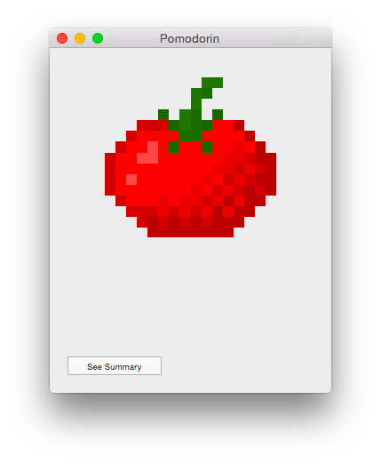
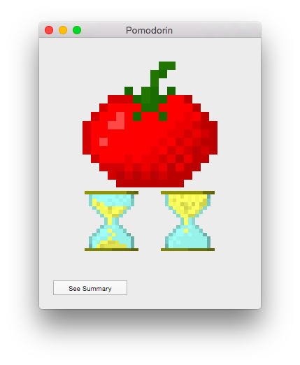
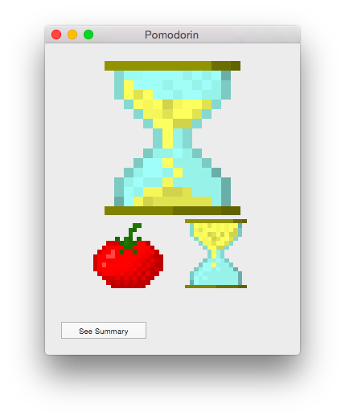
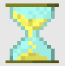
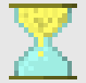

[Versión en español](README_es.md)

# Introduction

On the daily use of the *Pomodoro Technique (R)*, I prefer to use a pencil and a diary for the task tracking. Handwriting all of that allows to be more concious of the pending things to do.

So, were looking for a simple timer for this technique, including some features that are boring to do with pencil and paper, like record diary statistics of finished pomodoris and interruptions and not much more.

Most of the better software tools found for this technique available, includes functionality that makes the UI more complex or distractive, like TO-DO lists, tasks categories and lots of options I do not want to be present there. Or, in the other extreme, are just too simple.

As couldn't find what I needed, implemented this one.

# Download

Checkout the most recent release [here](https://github.com/mmazzei/Pomodorin/releases).

# Usage

The UI target is to be simple and clear. If you allways click at the big image at the center, it will do what you need most of the time.

## How to start a new pomodori?

You can click on the big tomato button:

  

If you just finished a break, the following window will be shown:

That could be different, depending on your current session, because Pomodorin will recommend you the next step, making that button bigger than the alternatives. So, if you just finished a pomodori, that window will look like:

It doesn't matter if small or big, the tomato button start a pomodori.

## How to start a break?

Just by clicking on the hourglass buttons.

Short break:

Long break:

## How to stop a pomodori or break?

The small "-" button at the bottom of the screen is what you want.

## How to automatically start pomodoris and breaks?

There are an *experimental* feature to do so: **Auto-mode**.

When Pomodorin is running in Auto-mode, automatically will start the next pomodori, short break or long break, depending on your previous actions.

You can activate that by clicking the small lock icon at the bottom of the screen.

If you close the Pomodorin application, the next pomodori or break will not be automatically started until you open it again.

# FAQ

## What is the meaning of the version name?

"A mi me anda" is a common software developer excuse. The meaning in english is: "It works for me".

If you are a programmer and need some ideas for your excuses, there are a nice site can be helpful for you: [programmingexcuses.com](http://programmingexcuses.com).

If you are not a programmer, do as if you never read this part. We do not invent excuses, that phrases are true comments from the soul!

## Why this page, the code and the UI are so bad written?

English is not my main language (good excuse!). Hope to have a collaborator to improve this in order to remove this question from here.

## How do you do to have a FAQ if there are no users yet?

Ok, I invented the questions to fill some space here.

Was about that or sit and write the next awesome Pomodorin feature.

## Why the Pomodorin application is so bad?

Is not the final version yet, is in alpha status. It lacks features and have plenty of bugs.

# Feedback

Do you want new features? Are there some weird bug to fix? Feel free to post your suggestions or bug reports in our [issue tracking tool](https://github.com/mmazzei/Pomodorin/issues). Or, if you don't have a GitHub account, just send me an email (email address visible in my [public profile](https://github.com/mmazzei)).

Do you want to contribute? Pull requests are welcomed!

# 3rd Party licenses

"Pomodoro (R)" and "Pomodoro Technique (R)" are registered trademarks by [Francesco Cirillo](http://pomodorotechnique.com).
